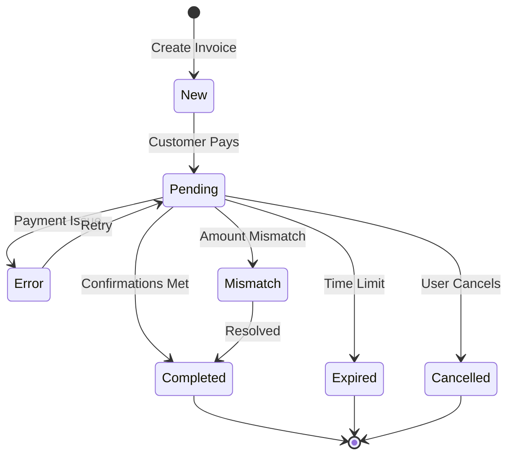

# Plisio Payment Integration

## Overview

Production-ready integration with Plisio cryptocurrency payment gateway, supporting multiple cryptocurrencies with secure webhook handling and comprehensive state management.

## Features

- ✅ **Multi-cryptocurrency support** (BTC, ETH, USDT, etc.)
- ✅ **Secure webhook verification** (HMAC-MD5)
- ✅ **Idempotent payment processing**
- ✅ **State machine for payment lifecycle**
- ✅ **Automatic retry with exponential backoff**
- ✅ **Real-time payment monitoring**
- ✅ **Comprehensive audit logging**
- ✅ **Fraud detection and prevention**

## Configuration

### Required Environment Variables

```env
# Plisio API Configuration
PLISIO_API_KEY=your-plisio-api-key
PLISIO_SECRET_KEY=your-plisio-secret-key
PLISIO_WEBHOOK_URL=https://yourdomain.com/api/webhooks/plisio

# Optional Settings
PLISIO_DEFAULT_EXPIRE_MIN=1440  # 24 hours
PLISIO_COMMISSION_RATE=0.005    # 0.5%
```

## API Endpoints

### Create Invoice

```http
POST /api/v1/payments/invoice
Content-Type: application/json
Authorization: Bearer {token}

{
  "orderName": "Premium Subscription",
  "orderNumber": "ORD-123456",
  "amount": "100.00",
  "currency": "USD",
  "email": "user@example.com",
  "description": "Monthly subscription payment",
  "successUrl": "https://app.com/payment/success",
  "failUrl": "https://app.com/payment/failed"
}
```

**Response:**
```json
{
  "status": "success",
  "data": {
    "txn_id": "5f7b8c9d0e1f2a3b4c5d6e7f",
    "invoice_url": "https://plisio.net/invoice/5f7b8c9d0e1f2a3b4c5d6e7f",
    "amount": "100.00",
    "currency": "USD",
    "expires_at": 1640995200,
    "qr_code": "data:image/png;base64,..."
  }
}
```

### Get Invoice Status

```http
GET /api/v1/payments/invoice/{txn_id}
Authorization: Bearer {token}
```

**Response:**
```json
{
  "txn_id": "5f7b8c9d0e1f2a3b4c5d6e7f",
  "status": "pending",
  "amount": "100.00",
  "currency": "USD",
  "confirmations": 2,
  "expected_confirmations": 6,
  "tx_hash": "0x123...",
  "created_at": "2024-01-15T10:30:00Z"
}
```

## Webhook Configuration

### Plisio Dashboard Setup

1. Log in to [Plisio Dashboard](https://plisio.net/account)
2. Navigate to **API** → **Webhooks**
3. Add webhook URL: `https://yourdomain.com/api/webhooks/plisio`
4. Copy the **Secret Key** to `PLISIO_SECRET_KEY`
5. Enable webhook notifications

### Webhook Security

#### Signature Verification

All webhooks are verified using HMAC-MD5:

```typescript
// Webhook payload structure
{
  "txn_id": "abc123",
  "order_number": "ORD-123",
  "amount": "100.00",
  "status": "completed",
  "hash": "a1b2c3d4e5f6..."  // HMAC signature
}

// Verification process:
1. Sort parameters alphabetically
2. Concatenate as: key1=value1|key2=value2|...|secret_key
3. Calculate MD5 hash
4. Compare with received hash
```

#### Idempotency

Duplicate webhooks are handled gracefully:
- Transaction ID is used as idempotency key
- Status transitions are validated
- Duplicate events are logged but not reprocessed

## Payment Status Flow



### Status Descriptions

| Status | Description | Action Required |
|--------|-------------|-----------------|
| `new` | Invoice created | Wait for payment |
| `pending` | Payment detected, awaiting confirmations | Monitor confirmations |
| `completed` | Payment confirmed | Credit user account |
| `expired` | Invoice expired | Create new invoice |
| `cancelled` | Payment cancelled | Clean up order |
| `error` | Processing error | Manual review |
| `mismatch` | Amount mismatch | Manual review |

## Usage Examples

### Complete Payment Flow

```typescript
// 1. Create order in database
const order = await prisma.order.create({
  data: {
    userId: user.id,
    summ: 100,
    status: 'pending',
  },
});

// 2. Create Plisio invoice
const invoice = await plisioService.createInvoice({
  orderName: 'Account Top-up',
  orderNumber: order.id,
  amount: '100.00',
  currency: 'USD',
  email: user.email,
  successUrl: `${APP_URL}/payment/success/${order.id}`,
  failUrl: `${APP_URL}/payment/failed/${order.id}`,
});

// 3. Save payment record
await prisma.payment.create({
  data: {
    txnId: invoice.data.txn_id,
    orderId: order.id,
    amount: invoice.data.amount,
    currency: invoice.data.currency,
    status: 'new',
  },
});

// 4. Redirect user to payment page
return {
  invoiceUrl: invoice.data.invoice_url,
  expiresAt: invoice.data.expires_at,
};

// 5. Webhook handles status updates automatically
```

### Check Payment Status

```typescript
// Manual status check
const status = await plisioService.getInvoice(txnId);

if (status.status === 'completed') {
  // Payment successful
  await creditUserAccount(status.order_number, status.amount);
} else if (status.status === 'pending') {
  // Show confirmation progress
  const progress = (status.confirmations / status.expected_confirmations) * 100;
  console.log(`Payment ${progress}% confirmed`);
}
```

### Handle Webhook

```typescript
// Webhook controller automatically:
// 1. Verifies signature
// 2. Checks idempotency
// 3. Validates state transitions
// 4. Updates payment & order status
// 5. Credits user balance (if completed)
// 6. Sends notifications
// 7. Creates audit logs
```

## Security Best Practices

### 1. Webhook Verification
```typescript
// Always verify webhook signatures
if (!plisioService.verifyWebhookSignature(payload)) {
  throw new HttpException('Invalid signature', HttpStatus.FORBIDDEN);
}
```

### 2. Amount Validation
```typescript
// Verify payment amount matches order
if (parseFloat(payload.amount) !== order.summ) {
  await flagForReview(payload.txn_id, 'Amount mismatch');
}
```

### 3. Rate Limiting
```typescript
// Protect webhook endpoint
@UseGuards(ThrottlerGuard)
@Throttle(10, 60) // 10 requests per minute
```

### 4. Audit Logging
```typescript
// Log all payment events
await prisma.log.create({
  data: {
    level: 'info',
    message: 'Payment processed',
    metadata: { txnId, amount, status },
  },
});
```

## Error Handling

### Common Errors

| Error | Cause | Solution |
|-------|-------|----------|
| `Invalid signature` | Wrong secret key | Verify `PLISIO_SECRET_KEY` |
| `Invoice expired` | Payment too late | Create new invoice |
| `Amount mismatch` | Wrong payment amount | Manual review required |
| `Duplicate webhook` | Plisio retry | Return success (idempotent) |

### Retry Strategy

```typescript
// Automatic retry configuration
{
  attempts: 3,
  backoff: {
    type: 'exponential',
    delay: 5000, // 5s, 10s, 20s
  },
}
```

## Monitoring & Metrics

### Key Metrics

1. **Payment Success Rate**
   ```typescript
   const successRate = completedPayments / totalPayments * 100;
   ```

2. **Average Confirmation Time**
   ```typescript
   const avgTime = averageTimeBetween('pending', 'completed');
   ```

3. **Webhook Processing Time**
   ```typescript
   const processingTime = webhookEndTime - webhookStartTime;
   ```

4. **Failed Payment Reasons**
   ```typescript
   const failureReasons = groupBy(failedPayments, 'status');
   ```

### Health Checks

```typescript
GET /api/health

{
  "plisio": {
    "status": "healthy",
    "lastWebhook": "2024-01-15T10:30:00Z",
    "pendingPayments": 5,
    "queueDepth": 0
  }
}
```

## Testing

### Unit Tests
```bash
npm test plisio.service.spec.ts
```

### Integration Tests
```bash
npm run test:e2e plisio.e2e-spec.ts
```

### Test Mode
```typescript
// Use test API key for development
PLISIO_API_KEY=test_key_xxxxx
PLISIO_TEST_MODE=true
```

### Webhook Testing
```bash
# Test webhook locally with ngrok
ngrok http 8080

# Update Plisio webhook URL to ngrok URL
# Send test webhook
curl -X POST http://localhost:8080/api/webhooks/plisio \
  -H "Content-Type: application/json" \
  -d @test-webhook.json
```

## Fraud Prevention

### 1. IP Whitelisting
```typescript
// Only accept webhooks from Plisio IPs
const PLISIO_IPS = ['185.10.68.0/24'];
```

### 2. Amount Tolerance
```typescript
// Allow small variance for conversion rates
const tolerance = 0.01; // 1%
const isValid = Math.abs(received - expected) / expected <= tolerance;
```

### 3. Velocity Checks
```typescript
// Limit payment frequency per user
const recentPayments = await getRecentPayments(userId, '1h');
if (recentPayments.length > 5) {
  await flagForReview(userId, 'High payment velocity');
}
```

## Reporting

### Transaction Reports
```typescript
// Generate daily payment report
const report = await plisioService.getPaymentStatistics(
  startOfDay,
  endOfDay,
);
```

### Reconciliation
```typescript
// Match Plisio transactions with database
const reconciledPayments = await reconcilePayments(
  plisioTransactions,
  databasePayments,
);
```

## Support

- [Plisio Documentation](https://plisio.net/documentation)
- [API Reference](https://plisio.net/documentation/api)
- [Support Email](mailto:support@plisio.net)
- Internal: `#payments` Slack channel